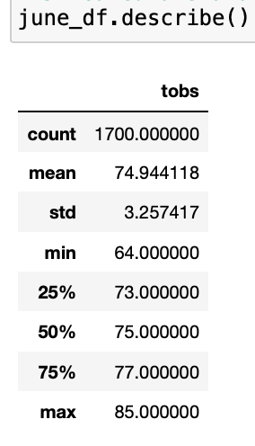
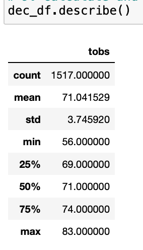
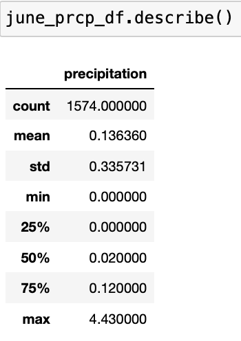
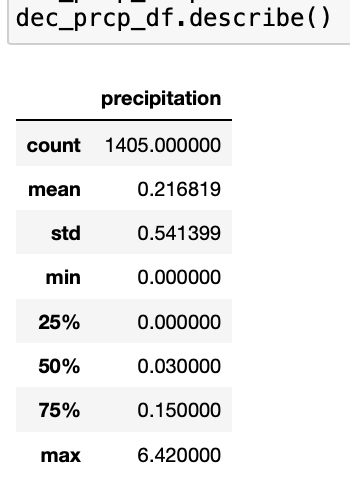

# Surfs Up Analysis
## Overview of the Analysis
* The purpose of this project was to analyze the weather in the months of June and Decemeber.  The Analysis from this project is being used by someone who is wanted to open a surf shop on the Hawaiian island Ohau.
* To complete this analysis, I imported the data into a Jupyter Notebook using sqlalchemy.  Then filtered the data, for the months I wanted to analyze.  
* Finally, I then put that data into a Pandas DataFrame to get the summary statistics of the weather for that month
## Results
* There are three key differences I noted in the weather in June vs. December
  * December can get to be colder than June.  The minimum temperature in December was 54 degrees F, while the minimum temperature in June was 64 degrees F.
  * The Average temperature in June is 75 degrees, while the Average in December is 71 degrees, so not a much of a difference compared to the minimum temperatures.
  * The maximum temperature for both months was a bit closer, with June having a max temperature of 85 degrees and December's max temperature was 83 degrees.
  * Below are the DataFrames I created that show the summary statistics for both Months:
 
 
 ## Summary
 * Overall, if just baseing the decision on temperature alone, I would advise that eventhough December can get a bit colder compared to June, it would still be a good idea to open the surf shop. 
 * However, there are some other aspects to weather to consider, such as precipitation.
 * I did do some additional analysis to look at the precipitation of both June and Decmeber as well.
 
 
 
